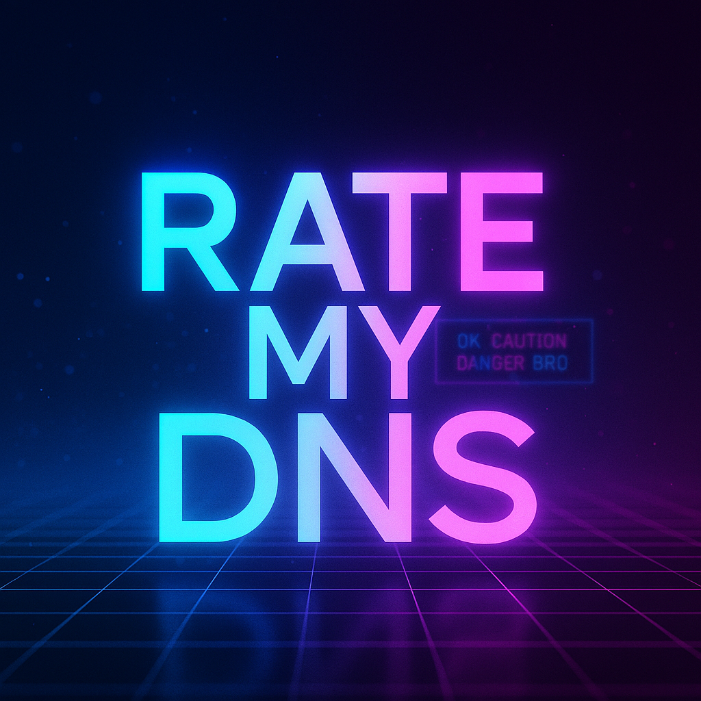

<p align="center">
  
</p>

# Rate My DNS

A modular, dependency‑free DNS auditing framework that evaluates DNSSEC, delegation, mail security, and zone health with Lynis‑style scoring. Designed for operators who prefer real diagnostics over web forms.

Rate My DNS consolidates checks normally scattered across tools like DNSViz, Hardenize, MXToolbox, Zonemaster, and various DANE/SPF/DMARC validators — but runs locally, fast, and without SaaS rate limits or 400MB of JavaScript.

---

## Features

- **DNSSEC validation**
- **Delegation and glue checks**
- **Zone serial and secondary sync verification**
- **TLSA/DANE validation**
- **SMTP STARTTLS certificate checks**
- **SPF, DKIM, and DMARC linting**
- **EDNS and TCP fallback testing**
- **IPv6 reachability**
- **Reverse DNS sanity checks**
- **Lynis‑style scoring:**  
```
[ OK ] [ CAUTION ] [ DANGER ] [ BRO ]
```
All modules are standalone Bash scripts, making the tool easy to extend and customize.

---

## Project Structure
```
rate-my-dns/
├── rate-my-dns.sh        # main executable
├── modules/              # individual checks
│   ├── dnssec.sh
│   ├── delegation.sh
│   ├── glue.sh
│   ├── tlsa.sh
│   ├── smtp.sh
│   ├── spf.sh
│   ├── dmarc.sh
│   ├── dkim.sh
│   ├── reverse.sh
│   ├── edns.sh
│   ├── tcp-fallback.sh
│   ├── ipv6.sh
│   └── zone-serial.sh
├── lib/                  # shared functions
│   ├── output.sh         # [OK] [CAUTION] [DANGER] [BRO]
│   ├── dns.sh            # wrappers for kdig/dig
│   └── util.sh           # helpers
├── .gitignore
├── LICENSE               # MIT
└── README.md
```
---

## Requirements

- Bash
- `kdig` (from Knot DNS utils)
- `dig` (optional fallback)
- `openssl`
- `swaks` (optional for SMTP testing)

No npm. No Python virtualenvs. No Docker. No nonsense.

---

## Usage

```bash
./rate-my-dns.sh example.com
```

***Modules run automatically and produce a Lynis‑style report.***

Example output:

```
[ OK ] DNSSEC chain validated (example.com)
[ OK ] Glue records consistent across all NS
[ CAUTION ] SPF uses softfail (~all)
[ DANGER ] DKIM key length < 2048 bits
[ BRO ] TCP fallback failed on ns3.example.com
```
---
## Installation (optional)

A Makefile is included for convenience:

```
sudo make install
```

This installs:

- rate-my-dns → /usr/local/bin
- modules → /usr/local/share/rate-my-dns/modules
- lib → /usr/local/share/rate-my-dns/lib

Uninstall:

```
sudo make uninstall
```

## Why This Exists
DNS tooling is fragmented across dozens of websites and scripts.
Rate My DNS brings those checks together into a single, fast, local, operator‑grade auditor — built for people who troubleshoot DNS like it’s a craft.